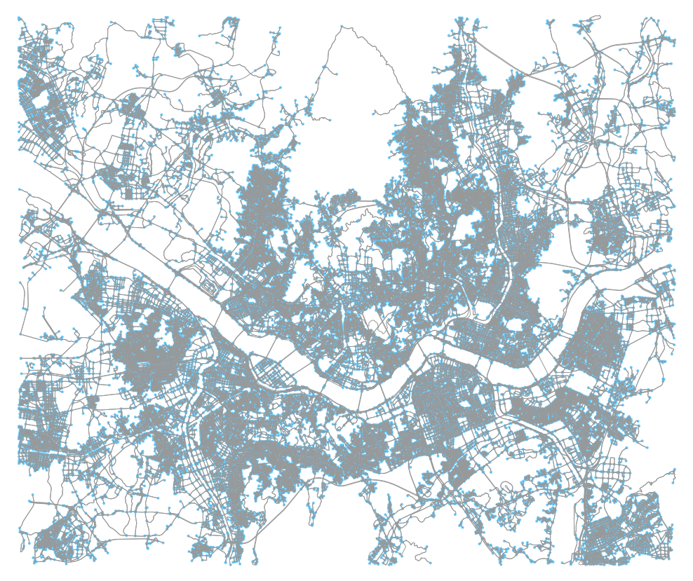

# TaxiSimulatorOnGraph


This repository is the official implementation of ["Optimizing Large-Scale Fleet Management on a Road
Network using Multi-Agent Deep Reinforcement Learning with Graph Neural Network"](https://arxiv.org/abs/2011.06175) by Juhyeon Kim and Kihyun Kim (ITSC 2021).

## Requirements

We use [Deep Graph Library](https://github.com/dmlc/dgl) (DGL)
and [OSMnx](https://github.com/gboeing/osmnx) to handle road network.
For backend of DGL, we use PyTorch.

To install all of the requirements:

```setup
conda config --prepend channels conda-forge
conda create -n roadnetwork --strict-channel-priority osmnx==0.14.1 python=3.7
conda activate roadnetwork
conda install pytorch torchvision torchaudio cudatoolkit=10.2 -c pytorch
conda install -c anaconda ipykernel
python -m ipykernel install --user --name=roadnetwork
pip install dgl-cu102==0.4.3.post2
```

## Training and Evaluation
### 10 by 10 grid city
`Tutorial_10by10GridCity.ipynb` runs a simulation on simple 10 by 10 grid-shaped city.

### Real city
For real city data, following notebook tutorials are available.

(1) Preprocessing
- `Tutorial_GraphSimplification.ipynb` performs graph simplification which is required to run simulation 
with large real data.
- `Tutorial_SpeedInfoGenerator.ipynb` generates speed information data at each road from raw speed data.

(2) Run Simulation
- `Tutorial_RealCity.ipynb` runs simulation (both train and evaluate) in Seoul with real call data.
- `Tutorial_RealCity_Multiprocessing.ipynb` runs simulation (both train and evaluate) using multiprocessing.
You need multi-GPU environment to run this code.

## Data
The data was provided from *Kakao mobility*, South Korea.
We upload example data in `data_example` folder to just check data format.

**Full data will not be uploaded.**

You should use your own data.
Public data (osmnx road data / speed data) is fully uploaded.
Please read `README_data.md` in `data_example` folder for the details.

## Visualization

You can export Q value of the road at each time stamp to SVG file by enabling `export_q_value_image` option in evaluation function.
Following is the video that shows Q values of roads in Seoul at each time stamp in a single day.
Note that red means higher value and green means lower value.

